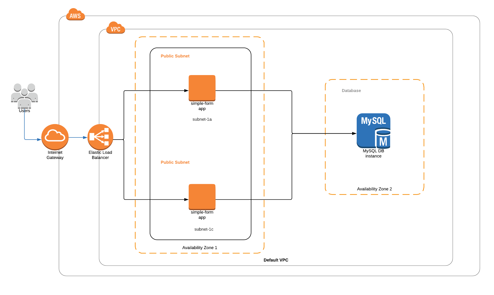

# Simple Form

## Appearance

<h3 align="center">
  
</h3>

## Introduction
This simple application should display a form that accepts three fields as input: "Name", "Favorite Color", "Cats or Dog". This form will save the result in a relational database 
and ensure that "Name" is unique. To achieve this I used Python Flask and MySQL, as well as ansible deploying the entire stack. (infrastructure and application on aws)

## Dependencies:

```
- local python-pip, awscli and ansible installation
- inform default vpc (inform vpc_id, subnet_id and az)
- access_key & secret_key (admin)
- inform aws region
- an existing .pem key
- move .pem key to ~/.ssh (ansible default)
- chmod 400 .pem key
- create ~/.boto file
- configure aws credentials
- ansible version 2.8.4 deployed
```

## Example files

```
# Example ~/.boto file
[Credentials]
aws_access_key_id = foo
aws_secret_access_key = bar

Example ~/.aws/credentials file
[default]
aws_access_key_id = foo
aws_secret_access_key = bar
```

## Ansible Installation

[Installation Guide](https://docs.ansible.com/ansible/latest/installation_guide/intro_installation.html)

## First Steps

**In order to run the playbook you need to replace some information**
```
.hosts: change ansible_ssh_private_key_file to your ~/.ssh/.pem file
get_rds_endpoint.sh: change the variable PEM to your ~/.ssh/.pem file
get_rds_endpoint.sh: change the variable REGION at your choice
infra.yml: in the vars section, update your region, azones_1a, azones_1c, subnets, keypair variables
```

## Deploy Infrastructure 
```
1. run the command 'ansible-playbook infra.yml -vvvv'
   PS: it is possible to have a failing in the security_group_RDS creation, run again the step 1. (probably it is a bug depending on the ansible version)
2. add the two instances public ip in .hosts files under #xxx.xxx.xx.xxx (the terminal will display both of them)
3. some tasks may take several minutes do deploy
```

## Deploy Application
```
1.  run the commmand 'ansible-playbook deploy.yml'
```

## Get RDS endpoint and replace into webservers

```
1. run the command './get_rds_endpoint.sh'
   PS: make sure you have the access_key & secret_key configured on ~/.aws/credentials.
```
